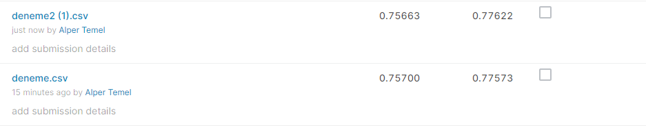

 

 

# The purpose of the competition

Müşterilerimiz tarafından 1 Ocak 2019 -30 Haziran 2019 tarihleri arasında farklı sektörlerde yapılan alışverişlere ait ay ve sektör bazlı harcama adetleri ve tutarları anonimleştirilerek ve kişisel veri içermeyecek şekilde tarafınıza sunulmuştur. Ayrıca; bu anonim verilere harcamayı yapanların yaş, eğitim ve meslek bilgileri gibi demografik verilerle Bankamız müşterisi olma süresini gösteren “banka kıdem süresi” bilgisi de eklenmiştir.

💍Sizlerden submission/target verisi olarak hangi müşterilerin 2019 Haziran ayı sonrası ilk 6 ay içerisinde evlendiğini tahminlemeniz beklenmektedir.

# Metric

Metrik kriteri olarak AUC (area under receiver operating characteristic curve) değeri seçilmiştir. Gönderilen Submission'lar (1, 0) gerçek değerler ile kıyaslanacak, yarışma tamamlandığında Private Leaderboard'da en iyi AUC değerine ulaşan yarışmayı kazanmış olacak.

# Data

- train.csv - training veri seti
- test_set.csv - test veri set
- monthly_expenditures.csv - aylık müşteri harcama verileri
- sampleSubmission.csv - doğru formatta örnek submission dosyası

# Data detail

## (test.csv - train.csv)
- MUSTERİ -müşterinin tekil müşteri numarası
- YAŞ -müşterinin yaşı
- KIDEM_SURESI -müşterinin kaç aydır banka müşterisi olduğu bilgisi
- EĞİTİM -müşterinin eğitim durumu
- İS_DURUMU -müşterinin çalışma durumu
- MESLEK_GRUBU -müşterinin yer aldığı meslek grubu
- TARİH ilgili bilgilerin alındığı tarih (tüm satırlar için aynı)
## (monthly_expenditures.csv)
- MUSTERİ -müşterinin tekil müşteri numarası
- SEKTOR -harcamaların yapıldığı sektör
- ISLEM_ADEDI -ilgili tarih ve sektörde müşterinin yaptığı işlem adedi
- AYLIK_TOPLAM_TUTARI -müşterinin ilgili yıl/ay, tür ve sektörde yaptığı işlemlerin toplam tutarı
- TARİH -müşterinin harcama yaptığı tarih (YIL/AY)

## Libraries Used
- pandas
- numpy
- sklearn
- xgboost
- imblearn
- tensorflow
- keras
- scipy

## Author
- Alper Temel [Author](https://github.com/alpertml)

Get in Touch
-
If you want some help or want to give advice about the app etc. feel free to send a private email to me:

• tml.alper@gmail.com

• alper.temel@ceng.deu.edu.tr
